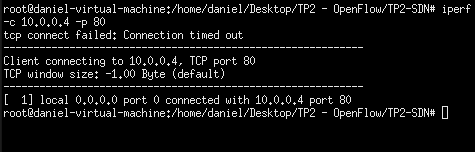

# TP2-SDN

Trabajo Practico 2 de Introduccion a Sistemas Distribuidos

# Pasos

Ejecutar controlador:  
    python3 pox.py log.level --DEBUG forwarding.l2_learning controller 

# Comando para ejectuar la topologia personalizada
## Ejecutar en otra terminal:

n = cantidad de switches (tiene que ser mayor a 1)

### Ejecucion sin xterm

sudo mn --custom example.py --topo mytopo,n --mac --arp --switch ovsk --controller remote

### Ejecucion con xterm

sudo mn --custom example.py --topo mytopo,n --mac --arp -x --switch ovsk --controller remote

# Pruebas pedidas

1) Se deben descartar todos los mensajes cuyo puerto destino sea 80.
    - Host 4 actua como servidor escuchando en el puerto 80 
        sudo iperf -s -p 80
    - Host 1 actua como cliente
        sudo iperf -c 10.0.0.4 -p 80
    
    * Del lado del servidor se observa lo siguiente:

    

    * Del lado del cliente se observa lo siguiente:

    

2) Se deben descartar todos los mensajes que provengan del host 1, tengan como puerto destino el 5001, y esten utilizando el protocolo UDP

    * Servidor:

    

    * Cliente:

    

3) Se debe elegir dos hosts cualquiera, y los mismos no deben poder comunicarse de ninguna forma (se eligieron los host 2 y 3)

    * Pingall:

    

# Notion
[TP2](https://mis-notas.notion.site/TP2-0c7f3987e3324e289050206e3edb01a4?pvs=4)
